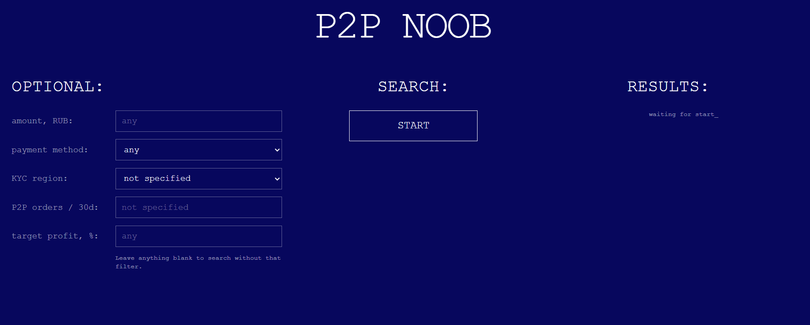
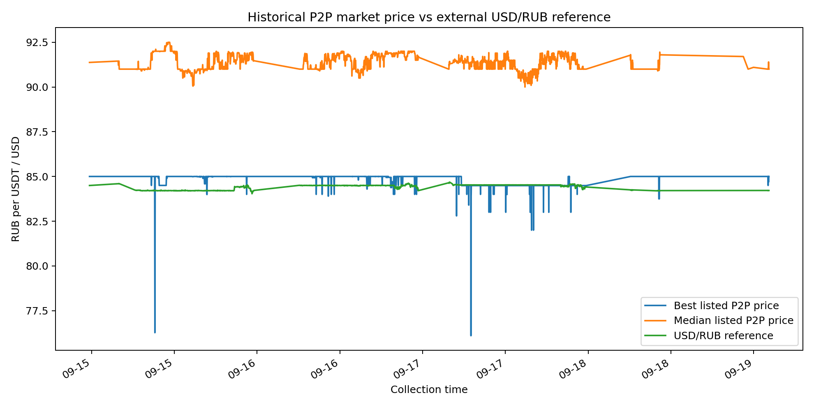
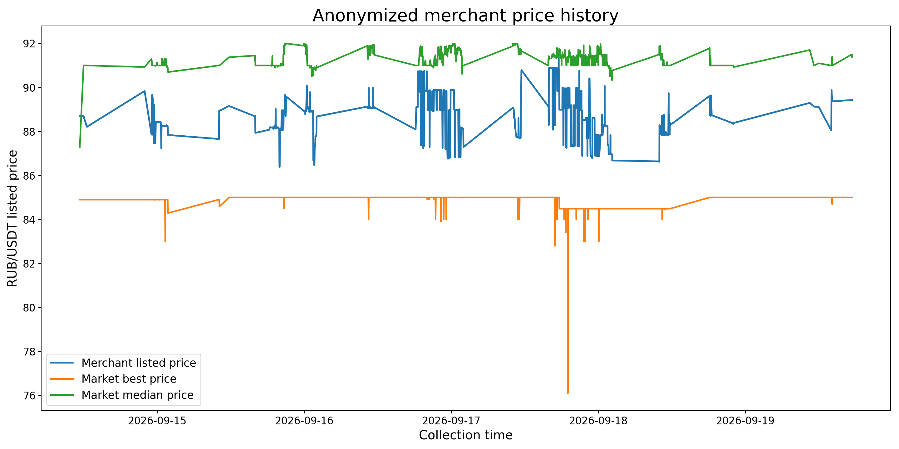

# P2P NOOB

**P2P NOOB** is a prototype decision-support service for monitoring **Bybit P2P RUB → USDT** offers. It continuously searches for suitable orders, applies merchant-quality and user-compatibility filters, compares prices with an external USD/RUB reference, and notifies the user when a configured target is reached.

The service also accumulates historical market data in PostgreSQL and uses it to study merchant behavior and market conditions over time.

The core backend implementation is kept in a private repository. This public repository focuses on the product idea, engineering decisions, product demos, anonymized historical analysis, QA evidence, and a small UI template/style sample.

> Experimental decision-support project. It does not execute trades or provide financial advice.

## Problem

Attractive P2P offers can appear and disappear quickly, so finding one manually may require constantly refreshing the market throughout the day.

At the same time, the cheapest available ad is not automatically the best choice. A useful order also has to satisfy merchant-quality rules, user-specific restrictions, amount and payment constraints, and a price condition relative to an external FX benchmark.

P2P NOOB automates this routine by continuously monitoring the market and notifying the user when a suitable opportunity appears.

## Demo

### Live monitoring

The web interface starts continuous monitoring, locks the active search parameters, tracks elapsed time, and displays the latest matching qualified order.



### Telegram alert

When a qualified order reaches the configured target, the monitor sends a Telegram notification with the order details and calculated edge.

<p align="center">
  
</p>

> Merchant names, order IDs, and merchant-specific links shown in the public demos are anonymized.

## Historical database & analysis

The PostgreSQL collector accumulated a real multi-day history containing:

- **2,376 snapshots**;
- **581,962 stored market-order rows**;
- **887 distinct merchants**.

The collected history is used to examine market behavior over time, compare listed prices with an external reference, study individual merchant activity, and evaluate filtering decisions on real historical data.





See [`analysis/README.md`](analysis/README.md) for the full historical analysis, anonymized data exports, integrity checks, and methodology.

## QA

The project has gone through structured QA covering smoke, functional, negative, exploratory, endurance, research, retest, and targeted regression testing.

Input-validation and UI issues found during testing were fixed and retested.

One major issue remains open: a rare historical collection cycle had a roughly 12-hour recorded wall-clock interval, included a Bybit timeout, and later saved the delayed snapshot. The cause and location of the delay remain unconfirmed. The issue was not reliably reproduced by manual network-loss experiments and has a separate diagnostic research plan.

See [`qa/README.md`](qa/README.md) for the testing approach, results, and current defect status.

## Repository contents

```text
.
├── README.md
├── demos/
│   ├── web_monitor_demo.gif
│   └── telegram_alert_demo.gif
├── analysis/
│   ├── README.md
│   ├── charts/
│   └── data/
├── qa/
│   ├── README.md
│   ├── test_plan.md
│   ├── defects.md
│   ├── test_results.md
│   └── evidence/
│       └── long_collection_cycle_terminal.jpg
├── templates/
│   └── index.html
└── static/
    └── style.css
```

The `templates/` and `static/` folders are a small public UI sample. The backend collector, database access layer, API integration code, credentials/configuration, and the full historical dataset remain private.
