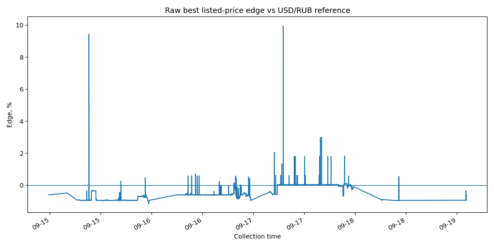

# Historical database analysis

The private collector stores timestamped Bybit P2P market snapshots in PostgreSQL.
This public section exposes only anonymized aggregate/history exports and charts.

## Dataset overview

| Metric | Value |
|---|---:|
| Collection period | 2026-09-12 → 2026-09-19 |
| Snapshots collected | 2,376 |
| Market-order rows stored | 581,962 |
| Distinct merchants observed | 887 |
| Average orders per snapshot | 244.93 |
| Median collection duration | 28.20 s |
| p95 collection duration | 39.83 s |
| Reference-bearing snapshots | 2,132 / 2,376 (89.7%) |
| Stored-order count mismatches | 0 |
| Cycles over 120 seconds | 1 |
| Cycles over 1 hour | 1 |

The maximum recorded collection duration was **43,424.65 seconds**.
That outlier is the same abnormal V2 cycle documented in the QA section as an open research issue.

## Market history


The chart compares the **raw** best listed P2P price, the market median, and the stored external USD/RUB reference.
Reference-based charts begin at the first snapshot where a reference value exists.

## Raw listed-price edge



`best_edge_pct` is calculated as:

```text
(reference_rate - best_listed_price) / reference_rate * 100
```

Across the 2,132 reference-bearing snapshots, the raw best listed price was below the reference in
**970 snapshots (45.5%)**.

This is **not net profitability** and is not a trade signal. V2 stores a broad market view; user compatibility,
merchant-quality gates, payment constraints, and transaction costs belong to later decision layers.

## Collector health


Most cycles cluster around tens of seconds, while one extreme long-running cycle is clearly visible.
The database therefore also acts as an observability source for endurance testing and defect research.

The integrity export reports **0 declared-vs-saved order-count mismatches** across 2,376 checked snapshots.

## One market snapshot


The public snapshot export contains **365 ads** from snapshot `2378`.
Merchant identities are replaced with generated aliases.

## Anonymized merchant history


The merchant-history export automatically selects one frequently observed merchant and replaces its identity with
`merchant_sample`. It demonstrates that the schema supports longitudinal entity analysis rather than only isolated snapshots.

## Public data files

- [`database_summary.csv`](data/database_summary.csv) — one-row database overview.
- [`market_history.csv`](data/market_history.csv) — snapshot-level market and collector time series.
- [`snapshot_profile.csv`](data/snapshot_profile.csv) — one anonymized market snapshot.
- [`merchant_history.csv`](data/merchant_history.csv) — anonymized longitudinal merchant sample.
- [`database_integrity_summary.csv`](data/database_integrity_summary.csv) — compact data-quality/collector-health checks.

## Privacy and scope

The public exports exclude real merchant names, merchant IDs, order IDs, remarks, trading-preference JSON,
verification metadata, database credentials, and the full PostgreSQL database.

The first 244 snapshots in the export do not contain a stored reference rate,
so they are omitted from reference-dependent calculations.
