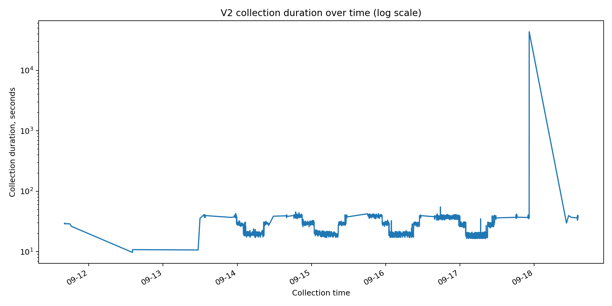
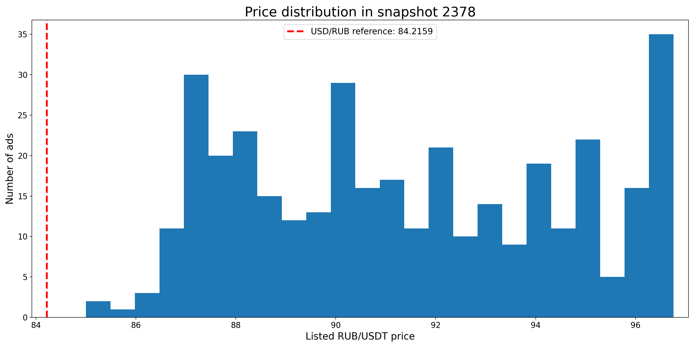

# Historical database analysis

The service stores timestamped Bybit P2P market snapshots in PostgreSQL.
This public section exposes only anonymized aggregate/history exports and charts.

## Dataset overview

| Metric | Value |
|---|---:|
| Collection period | 2026-09-12 → 2026-09-19 |
| Snapshots collected | 2,376 |
| Market-order rows stored | 581,962 |
| Distinct merchants observed | 887 |
| Average orders per snapshot | 244 |
| Snapshots with USD/RUB reference | 2,132 / 2,376 (89.7%) |

## Market history

The chart compares the **raw best listed P2P price**, the market median, and the stored external USD/RUB reference.
Reference-based data begins at the first snapshot where a reference value exists.

Across the **2,132 snapshots with a USD/RUB reference**, the raw best listed price was below the reference in
**970 snapshots (45.5%)**.

This does **not** represent net profitability or a trade signal. The comparison uses raw listed market prices and does not include user compatibility, merchant-quality filters, payment constraints, or transaction costs.

## Collection health

Most collection cycles cluster around tens of seconds, while one extreme long-running cycle is clearly visible.
The stored history therefore also provides useful evidence for endurance testing and defect research.

## One market snapshot

The public snapshot export contains **365 ads** from snapshot `2378`.
Merchant identities are replaced with generated aliases.

The external USD/RUB reference at that moment was **84.2159** and is shown as a separate line on the chart, so its position relative to the listed P2P prices is directly visible.

## Anonymized merchant history

The merchant-history sample follows one frequently observed anonymized merchant whose listed price changed substantially during the observed period.
In this sample, the merchant price ranged from **86.39 to 91.68 RUB/USDT** across **182 distinct listed prices**.

The chart compares the merchant with the market best and market median, showing how the collected database can be used for longitudinal merchant analysis rather than only isolated market snapshots.

## Public data files

- [`database_summary.csv`](data/database_summary.csv) — one-row database overview.
- [`market_history.csv`](data/market_history.csv) — snapshot-level market and collection time series.
- [`snapshot_profile.csv`](data/snapshot_profile.csv) — one anonymized market snapshot.
- [`merchant_history.csv`](data/merchant_history.csv) — anonymized longitudinal merchant sample.
- [`database_integrity_summary.csv`](data/database_integrity_summary.csv) — compact data-quality and collection-health checks.

## Privacy and scope

The public exports exclude real merchant names, merchant IDs, order IDs, remarks, trading-preference JSON,
verification metadata, database credentials, and the full PostgreSQL database.

The first 244 snapshots in the export do not contain a stored reference rate,
so they are omitted from reference-dependent calculations.
