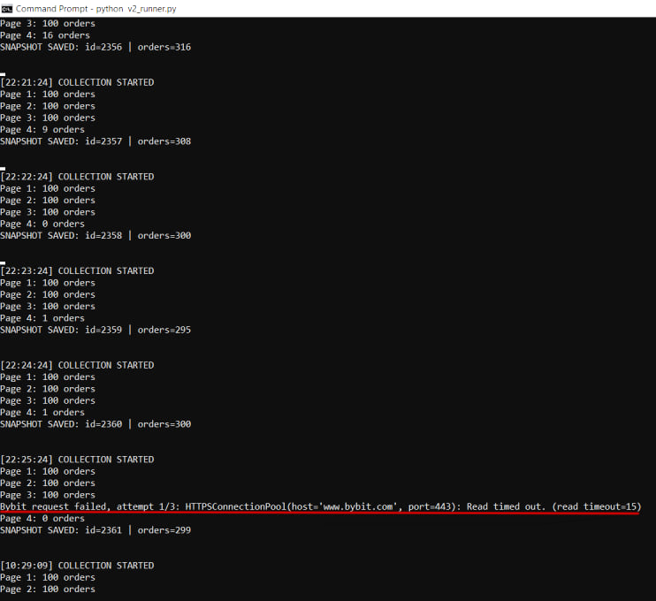

# Bug Reports

## BUG-001 — Historical collection cycle can remain active for hours and still save a delayed snapshot

**Bug ID:** `BUG-001`  
**Status:** 🟡 OPEN  
**Retest Status:** 🔴 NOT RUN  
**Severity:** Major  
**Priority:** High  
**Component:** `b3c1 — Scan Bybit P2P Market and Collect Market Snapshot`  
**Related risk:** `b3c1r3 — Long-running collection becomes stuck or stops updating`  
**Related test:** `b3c1r3t2`  
**Detection:** Endurance testing during continuous historical collection  
**First detected:** 2026-09-18 22:25:24.519730 +04:00  
**Reproducibility:** Not reproduced reliably  

---

### Description

A historical market collection cycle started normally but later completed only after an approximately 12-hour wall-clock interval. The delayed snapshot was still saved to PostgreSQL as a normal historical snapshot. The available terminal evidence shows that collection started, several pages were fetched, a Bybit request timeout was logged after page 3, page 4 was later fetched, the snapshot was saved, and the next collection cycle started normally without a manual restart.

### Impact

Market data collected far apart in time may be stored and later interpreted as one ordinary historical snapshot. This can reduce the reliability of later historical market analysis because the snapshot may no longer represent one consistent market state.

### Expected Result

A historical snapshot should represent a bounded collection interval suitable for market analysis. If a collection cycle becomes excessively delayed or cannot complete required requests, it should fail explicitly or be marked as unsuitable for ordinary historical analysis. The exact maximum acceptable collection interval has not yet been defined as a product requirement.

### Actual Result

Snapshot `2361` was stored successfully after an approximately 12-hour wall-clock interval. The next collection cycle started normally without a manual restart.

---

### Evidence

**Incident Data:**

| Field | Recorded value |
|---|---|
| Collection start | `2026-09-18 22:25:24.519730 +04:00` |
| Collection finish | `2026-09-19 10:29:09.164839 +04:00` |
| Recorded duration | `43,424.645 s` (~12 h 4 min) |
| Snapshot ID | `2361` |
| Declared / saved orders | `299 / 299` |
| Database source | `analysis/data/market_history.csv` |

**Terminal screenshot:**

  

**Observed Sequence:**

1. Collection cycle started.
2. Market pages were fetched.
3. A Bybit request timeout occurred after page 3.
4. Page 4 was later fetched.
5. Snapshot `2361` was saved.
6. The next collection cycle started normally.

**Limitations:** A complete text log for the original incident was not retained. The available screenshot does not contain timestamps around each internal processing stage. Because of this, the evidence does not establish where the full delay occurred or prove that the process was executing continuously during the entire 12-hour interval. The network timeout is therefore a diagnostic hypothesis rather than a confirmed root cause. Host sleep/resume and other timing effects have not been excluded.

---

### Defect Reproduction

| Attempt | Test&nbsp;type | Description | Status | Result |
|---|---|---|---|---|
| 1 | Negative | Network loss until retry exhaustion | COMPLETED | NOT&nbsp;REPRODUCED |
| 2 | Negative | Connectivity restored before timeout | COMPLETED | NOT&nbsp;REPRODUCED |
| 3 | Endurance | 529 consecutive historical collection cycles | COMPLETED | NOT&nbsp;REPRODUCED |
| 4 | Research&nbsp;/&nbsp;Negative | Put the host to sleep during an active collection cycle and resume it later | NOT RUN | — |
| 5 | Research&nbsp;/&nbsp;Negative | Introduce a prolonged interruption during an active collection cycle and observe timing after recovery | NOT RUN | — |
| 6 | Research&nbsp;/&nbsp;Endurance | Run prolonged historical collection with stage-level timestamps and monotonic timing enabled | NOT RUN | — |
