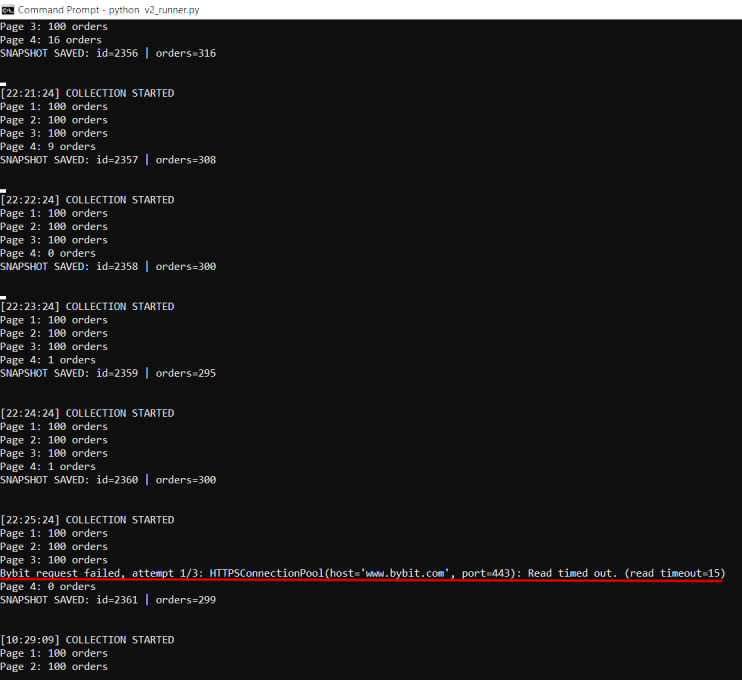

# Defect records

These records restructure existing observations from `test_results.md`; no new tests were run for this documentation revision. Missing historical details are marked explicitly. QA-002 and QA-003 are documentation identifiers assigned during this review, not original tracker IDs.

## BUG-001 - Historical snapshot spans an abnormal wall-clock interval

- **Status:** Open; not reliably reproduced; cause unconfirmed.
- **Severity / priority:** Major / High, as recorded in the original report.
- **Component:** Historical market collector and snapshot persistence.
- **Environment:** Windows, Python virtual environment, local PostgreSQL, Bybit external endpoint. Exact versions, build/commit and host power state were not retained.
- **Detection:** Continuous historical collection during endurance testing.
- **Observed sequence:** Collection started; pages were fetched; a request timeout was logged after page 3; page 4 and snapshot save were subsequently logged; the next cycle started without a manual restart. This is an observed sequence, not a deterministic reproduction procedure.
- **Expected behavior:** Historical snapshots should represent a bounded collection interval suitable for market analysis. An excessively delayed collection should be failed or explicitly marked as unsuitable for ordinary analysis. The exact maximum allowed interval remains to be specified.
- **Actual behavior:** Snapshot 2361 was stored with 299 rows after an approximately 12-hour wall-clock interval. The next collection cycle started normally.
- **Impact:** Data collected far apart in time may be interpreted as one ordinary market snapshot.

### Evidence

Source: `analysis/data/market_history.csv`, snapshot 2361.

| Field | Recorded value |
|---|---|
| Collection start | 2026-09-18 22:25:24.519730 +04:00 |
| Collection finish | 2026-09-19 10:29:09.164839 +04:00 |
| Duration in export | 43,424.645 seconds |
| Declared / saved orders | 299 / 299 |

The screenshot records a request timeout, but lacks timestamps around individual stages. It does not locate the delay or prove continuous process execution. A network failure is a diagnostic hypothesis, not an established root cause. Host sleep/resume and other timing effects have not been excluded by this evidence.

### Reproduction attempts and follow-up

- Network loss until retry exhaustion: not reproduced, per the original test report.
- Connectivity restored before timeout: not reproduced, per the original test report.
- Subsequent 529-cycle endurance run: not reproduced, per the original test report. Full follow-up logs are not included.

Non-reproduction does not establish a fix. Add stage-level timestamps, a monotonic duration measurement and host power-event evidence before attributing the cause. Define the permitted snapshot interval separately as a product requirement.

## QA-002 - Zero amount accepted when starting monitoring

- **Status:** Fixed and retested according to the original test notes; no new verification in this revision.
- **Component:** Web amount validation.
- **Precondition:** Web interface open with monitoring stopped.
- **Recorded action:** Enter `0` as the amount and start monitoring. Other input values and the exact build were not retained.
- **Expected behavior:** Reject a zero amount; an empty value is separately supported as “any amount”. This expectation follows the original classification of zero as a failure.
- **Actual pre-fix behavior:** Monitoring started.
- **Impact:** An invalid amount can enter the monitoring flow.
- **Fix verification:** Original notes mark the case FIXED / RETESTED; they do not retain the exact validation message or a dedicated screenshot.
- **Related recorded regression scope:** Valid amount/start flow, negative and fractional values, stop/restart and the critical monitor-to-Telegram path. These checks were reported at iteration level, not individually linked to this defect.

## QA-003 - Search parameters remain editable during active monitoring

- **Status:** Fixed and retested according to the original test notes; no new verification in this revision.
- **Component:** Active-monitoring UI state.
- **Precondition:** Monitoring successfully started with valid parameters.
- **Recorded action:** Attempt to edit optional search parameters while monitoring is active. Exact original values and build were not retained.
- **Expected behavior:** Active search parameters are locked until monitoring stops, consistent with the documented UI behavior.
- **Actual pre-fix behavior:** The optional-parameters menu remained editable.
- **Impact:** The visible settings can create ambiguity about which parameters the active search uses. A backend parameter change was not established in the notes.
- **Fix verification:** Original notes mark the issue FIXED / RETESTED. The public demo illustrates the intended locked state; it is not pre-fix evidence.
- **Related recorded regression scope:** Active state, timer/refresh, second-tab state and stop/restart. These are iteration-level checks, not newly executed tests.

## Findings requiring clarification

- Target-profit `-0`: the precise original failure and normalization rule were not retained.
- Explicit leading `+`: acceptance alone does not demonstrate a defect; the required input/formatting rule must be specified.
- Extremely large amount and target-profit values: supported bounds remain undefined.
- Connectivity status: the original test notes report insufficient user-facing retry/connection feedback; this remains an open UX finding.

These gaps must not be replaced with invented reproduction details or fresh PASS results.
